# Automated Email Attachment Organizer
## Purpose
This workflow solves the common business problem of disorganized email attachments by providing an automated system for categorizing and storing files in a structured manner.
It eliminates manual file organization tasks, reduces human error in filing, and creates a consistent digital archive that improves document retrieval efficiency.
The system ensures compliance with organizational filing standards while maintaining security through sender verification.

## Target audience
This solution targets business professionals across multiple departments including finance teams processing vendor invoices, human resources departments handling candidate resumes, legal teams managing contract documents, and administrative staff organizing departmental communications.
It benefits organizations with structured document submission processes and teams that require consistent digital filing standards for compliance and operational efficiency.

## Overview
The workflow operates on a trigger-process-organize architecture where Gmail serves as the input source, Google Sheets provides authorization control, and Google Drive functions as the organized storage destination.
The system implements a multi-layer validation approach starting with email filtering, progressing through sender authorization, and culminating in structured file organization.
The folder hierarchy follows a logical business taxonomy of company/year/month, creating an intuitive navigation structure while timestamp prefixes ensure file uniqueness and chronological ordering.

```mermaid
  flowchart TD
    A[📧 Gmail Trigger<br/>Poll emails with Label_2] --> B{🔍 Whitelist Check<br/>Verify sender in Google Sheets}
    B -->|Approved| C{🏢 Company Folder<br/>Check if exists}
    B -->|Rejected| Z[❌ Workflow Ends]
    C -->|Not Found| D[📁 Create Company Folder]
    C -->|Found| E[📅 Year/Month Logic<br/>Generate folder structure]
    D --> E
    E --> F{📂 Month Folder<br/>Check if exists}
    F -->|Not Found| G[📁 Create Month Folder]
    F -->|Found| H[📧 Download Email<br/>With Attachments]
    G --> H
    H --> I[🔧 Split Attachments<br/>Process multiple files]
    I --> J[🔄 Loop Items<br/>Batch process files]
    J --> K[📤 Upload to Drive<br/>With timestamp prefix]
    style A fill:#4285F4,color:white
    style B fill:#34A853,color:white
    style C fill:#FBBC05,color:white
    style D fill:#EA4335,color:white
    style E fill:#4285F4,color:white
    style F fill:#34A853,color:white
    style G fill:#EA4335,color:white
    style H fill:#FBBC05,color:white
    style I fill:#4285F4,color:white
    style J fill:#34A853,color:white
    style K fill:#EA4335,color:white
    style Z fill:#666666,color:white
```

# How-to Guide
## Step by step
1. Begin by configuring all required OAuth2 credentials in n8n for Gmail, Google Drive, and Google Sheets services.
2. Create a Gmail label named 'Label_2' and apply it to test emails for verification.
3. Set up your Google Sheets whitelist with two columns mapping email addresses to company names.
4. Identify the target parent folder in Google Drive where the organized structure will be created.
5. Activate the workflow and test with a whitelisted email containing attachments.
6. Monitor the execution to ensure proper folder creation and file upload.
7. Verify the organized structure in Google Drive matches your expected company/year/month hierarchy.

## Conditional Paths
The workflow contains two primary conditional paths for folder management. If a company folder does not exist in the designated parent directory, the system automatically creates one using the company name from the whitelist. Similarly, if the year/month folder structure does not exist within the company folder, the workflow creates the necessary date-based directories. These conditional operations prevent duplicate folder creation while ensuring the organized structure remains intact. Failed whitelist verification results in immediate workflow termination without further processing.
## Success Criteria
Successful execution is confirmed when emails with the specified label from whitelisted senders result in properly organized attachments in Google Drive.
Verification criteria include the creation of appropriate company folders when needed, establishment of year/month subfolders, and successful upload of all attachments with timestamp prefixes.
The workflow should handle multiple attachments per email without errors and maintain consistent folder hierarchy across different senders and time periods.

# Reference
## Technical Specifications
The workflow utilizes n8n's polling mechanism with a 15-minute interval for Gmail monitoring.
It implements OAuth2 authentication for all Google service integrations.
The folder creation logic uses conditional checks to prevent duplicates, and the batch processing system handles multiple attachments through iterative looping.
File naming incorporates Unix timestamp prefixes for uniqueness. The system maintains state through execution context rather than persistent storage, making it stateless and horizontally scalable.
## Input/Output
### Input
| Attribute | Data Type | Description |
|-----------|-----------|-------------|
| Email Subject | String | Subject line of the incoming email |
| Sender Email | String | Email address of the message sender |
| Attachment Count | Number | Total number of attachments in the email |
| Company Name | String | Organization name from whitelist lookup |
| Email Date | Date | Timestamp when email was received |

### Output
| Attribute | Data Type | Description |
|-----------|-----------|-------------|
| Company Folder ID | String | Google Drive ID of the company directory |
| Month Folder ID | String | Google Drive ID of the year/month subdirectory |
| Uploaded File IDs | Array | List of Google Drive file IDs for uploaded attachments |
| Processing Timestamp | Date | Time when workflow completed processing |
| File Count | Number | Total number of successfully processed attachments |

## Dependencies
This workflow requires active internet connectivity and access to Google's API services. It depends on the Gmail API for email retrieval and attachment downloading, Google Drive API for folder management and file upload operations, and Google Sheets API for whitelist validation. The system assumes stable OAuth2 token management and requires proper configuration of API scopes for each service. External dependencies include the existence of the specified Gmail label and accessibility of the Google Sheets whitelist document.

# Tutorial
## Learning Path
Start by understanding the basic workflow structure through the Mermaid diagram visualization. 
Practice setting up a simple test environment with a single whitelisted email address and minimal folder structure. 
Progress to testing multiple attachments from different senders to observe the batch processing behavior. 
Experiment with modifying the folder naming conventions to understand how the date formatting affects organization.
Finally, explore edge cases such as emails without attachments or senders not in the whitelist to comprehend the complete workflow behavior.

## Practice Exercises
Create a test Google Sheets document with five email addresses and corresponding company names.
Send three test emails with different attachment types to whitelisted addresses using the specified Gmail label.
Monitor the workflow execution and verify the created folder structure matches your expectations.
Modify the date format in the YYYY/MM node to use a different structure and observe the changes in folder organization.
Test the workflow with an email from a non-whitelisted sender to confirm proper rejection behavior.
Experiment with adding additional processing steps after file upload, such as sending confirmation notifications.
