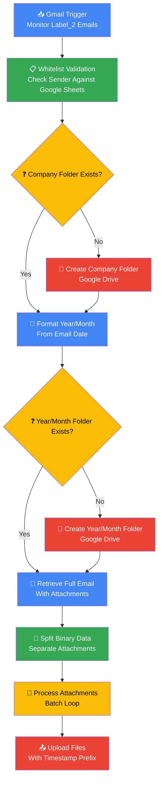

# Automated Email Attachment Organizer
## Purpose
🎯 This workflow solves the common business problem of disorganized email attachments by providing automated, structured storage in Google Drive. It eliminates manual file sorting, reduces human error in file organization, and ensures consistent naming conventions across all stored documents. The system maintains a clear audit trail of incoming documents while providing quick access through logical folder hierarchies.
## Target audience
👥 Primary users include administrative professionals managing client documentation, sales teams processing customer documents, accounting departments handling invoices and financial records, project managers organizing project deliverables, and legal teams managing contract submissions. Secondary users include IT administrators implementing document management solutions and business process automation specialists.
## Overview
🏗️ The workflow operates on a three-tier organizational structure: company-level folders containing year/month subfolders with timestamped individual files. It implements a whitelist security model to prevent unauthorized file processing, uses conditional folder creation to handle new companies and time periods automatically, and processes multiple attachments through batch operations for efficiency. The system maintains data integrity through consistent naming conventions and structured storage paths.

# How-to Guide
## Step by step
📝 Implementation guide:
1. Prepare your Google Sheets whitelist with two columns: sender email addresses and corresponding company names
2. Create a dedicated Google Drive folder that will serve as the parent directory for all company folders
3. In Gmail, create or identify the label (Label_2) that will trigger the automation
4. Configure the Gmail Trigger node with your OAuth2 credentials and set the polling interval to 15 minutes
5. Update the Google Sheets node with your whitelist spreadsheet ID and range
6. Modify all Google Drive nodes to reference your parent folder ID
7. Test the workflow by sending an email with attachments to a whitelisted sender address
8. Verify that folders are created correctly and files are uploaded with proper naming
## Conditional Paths
🔄 Workflow decision points:
• If sender email is not in whitelist → Workflow stops processing
• If company folder does not exist → System creates new company folder
• If year/month folder does not exist → System creates new date folder
• If email has multiple attachments → Each attachment processes individually
• If folder creation fails → Subsequent steps will not execute
• If file upload fails → Error is logged but other attachments continue processing
## Success Criteria
✅ Verification checklist:
• Emails with Label_2 trigger workflow execution
• Whitelisted senders process successfully
• New company folders create automatically when needed
• Year/month subfolders generate with correct formatting
• All attachments upload to appropriate folders
• Files receive timestamp prefixes in filenames
• No duplicate files from the same email
• Error-free execution for valid emails

# Reference
## Technical Specifications
⚙️ System configuration details:
• Polling interval: 15 minutes (configurable)
• Batch size: Default n8n settings (configurable)
• File naming: Timestamp + original filename
• Folder structure: Company/YYYY/MM/
• Supported file types: All Gmail attachment types
• Maximum file size: Google Drive upload limits apply
• Authentication: OAuth2 for all Google services
• Error handling: Conditional folder creation, batch processing
## Input/Output
📊 Data flow specifications:

| Attribute | Data Type | Description |
|-----------|-----------|-------------|
| Email Subject | String | Original email subject line |
| Sender Email | String | From address for validation |
| Attachment Count | Number | Number of files in email |
| Email Date | Date/Time | Received timestamp for folder creation |
| Company Name | String | Derived from whitelist lookup |
| Attachment Data | Binary | File content for upload |

| Output Attribute | Data Type | Description |
|------------------|-----------|-------------|
| Uploaded File URL | String | Google Drive file link |
| Folder Path | String | Created directory structure |
| Processing Status | String | Success/failure indicator |
| File Metadata | Object | Size, type, and timestamp information |
| Error Messages | String | Any processing failures encountered |
## Dependencies
🔗 External requirements:
• Google Workspace account with Gmail, Drive, and Sheets access
• OAuth2 credentials configured for all three Google services
• Pre-existing Google Sheets document with whitelist data
• Parent Google Drive folder with write permissions
• Network connectivity to Google APIs
• n8n instance with sufficient storage for temporary file processing

# Tutorial
## Learning Path
🎓 Progressive learning approach:
1. Start with basic setup: Configure one service at a time (Gmail → Sheets → Drive)
2. Test individual components: Verify trigger works, then whitelist lookup, then folder operations
3. Understand error scenarios: Test with non-whitelisted senders and missing folders
4. Explore customization: Modify folder naming and file processing logic
5. Scale the solution: Add multiple users and increase volume gradually
6. Implement monitoring: Set up alerts and logging for production use

## Practice Exercises
🏋️ Hands-on activities:
• Create a test whitelist with 5 sample companies and emails
• Send test emails with different attachment types (PDF, images, documents)
• Modify the folder naming convention to include project codes
• Add a notification step that sends confirmation emails
• Create a backup workflow that processes a different Gmail label
• Implement file type filtering to only process specific document formats
• Add metadata extraction for uploaded files
• Create a reporting node that tracks monthly upload statistics