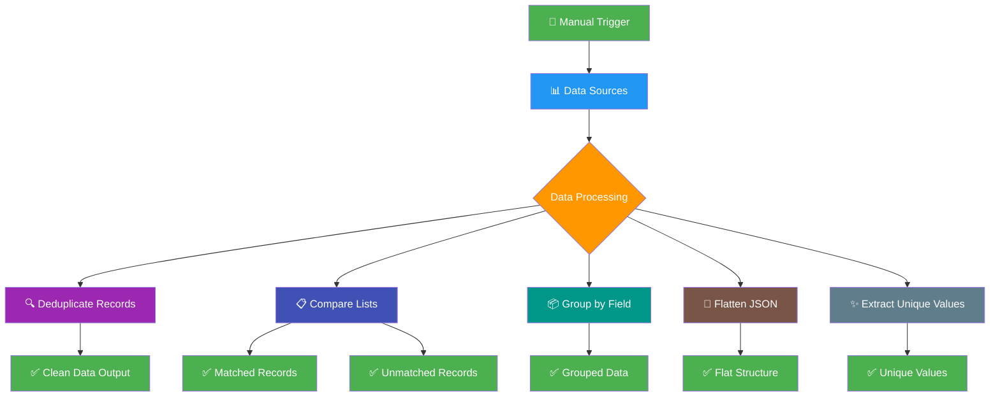

# Building Blocks - Loops & Flow Control
## Purpose
This workflow serves as a comprehensive toolkit for common data manipulation tasks, providing reusable patterns that can be integrated into larger automation processes. It addresses five fundamental data processing needs: cleaning duplicate records, comparing datasets, organizing data into groups, flattening complex nested structures, and extracting distinct values. Each pattern is implemented as an independent module that can be used standalone or combined with other workflows.
## Target audience
Data engineers and analysts who need to preprocess data for reporting or analysis. Automation developers building data pipelines. Business users who regularly work with customer data, sales records, or marketing lists. Technical teams implementing data validation and cleaning processes. The workflow is particularly valuable for organizations dealing with multiple data sources that require standardization.
## Overview
The workflow operates on a parallel processing model where five distinct data manipulation patterns execute simultaneously. Each pattern receives its own sample dataset and applies specialized transformation logic. The deduplication pattern uses JavaScript Sets to filter duplicate records based on email addresses. List comparison employs Merge nodes to perform set operations between customer and order datasets. Grouping dynamically creates object keys based on company values. JSON flattening recursively processes nested objects using dot notation. Unique value extraction collects distinct elements from array fields across multiple records.

# How-to Guide
## Step by step
1. Import the workflow into your n8n workspace using the import functionality
2. Examine the example datasets in the Set nodes to understand the input data structure
3. Execute the workflow using the manual trigger to see all patterns in action
4. Review the output from each processing path in the execution details panel
5. To use with your own data, replace the content of the Set nodes with your datasets
6. Ensure your data contains the required fields (email for deduplication and comparison, company for grouping, tag arrays for unique extraction)
7. Modify field references in Code nodes if your data uses different field names
8. Test each pattern individually by temporarily disabling other paths
## Conditional Paths
The workflow contains two conditional merge operations in the list comparison section. The first merge node keeps records where email addresses match between customers and orders, effectively performing an inner join. The second merge node keeps records where email addresses do not match, identifying customers without corresponding orders. These conditional paths demonstrate how to implement different types of dataset relationships. The deduplication path includes conditional logic that tracks seen values and filters duplicates based on the email field.
## Success Criteria
Successful execution produces five distinct output streams. The deduplication path should return records with unique email addresses. The list comparison should generate two outputs: customers with matching orders and customers without orders. The grouping path should organize leads into company-based groups. The flattening path should convert nested JSON into a flat structure with dot notation keys. The unique value extraction should return a distinct list of tags from all people records. Each output should contain the expected number of records based on the sample data.

# Reference
## Technical Specifications
The workflow consists of 21 nodes including 1 trigger node, 6 data source nodes, 5 split out nodes, 4 code nodes, 2 merge nodes, and 5 documentation nodes. All data processing occurs in memory using n8n's node execution engine. The Code nodes implement custom JavaScript logic for data transformations. The workflow uses n8n version 1.0 or higher and requires no external dependencies. Execution time scales with dataset size but remains efficient for typical business datasets.
## Input/Output
| Attribute | Data Type | Description |
|-----------|-----------|-------------|
| email | String | Primary field for deduplication and list comparison |
| company | String | Field used for grouping leads by organization |
| tag | Array | String array containing tags for unique value extraction |
| nested_data | Object | Complex JSON structure for flattening operations |
| customers | Array | Customer records for list comparison |
| orders | Array | Order records for list comparison |

| Output Attribute | Data Type | Description |
|------------------|-----------|-------------|
| unique_records | Array | Deduplicated records based on email field |
| matched_customers | Array | Customers with corresponding orders |
| unmatched_customers | Array | Customers without corresponding orders |
| grouped_leads | Object | Leads organized by company with array values |
| flat_json | Object | Flattened structure using dot notation keys |
| unique_tags | Array | Distinct tag values from all people records |
## Dependencies
The workflow has no external service dependencies and uses only n8n's core nodes. All data manipulation occurs within the n8n execution environment. The Code nodes require JavaScript runtime support. The workflow assumes input data follows the expected structure with specific field names (email, company, tag). No database connections, API credentials, or external services are required. The workflow is self-contained and can run in any n8n instance without additional configuration.

# Tutorial
## Learning Path
Start by executing the workflow with the provided sample data to observe all five patterns working simultaneously. Then focus on each pattern individually by temporarily disabling other paths. Study the JavaScript code in each Code node to understand the transformation logic. Experiment with modifying the sample data in Set nodes to see how changes affect the outputs. Practice extending the workflow by adding new data manipulation patterns using the existing structure as a template. Finally, integrate one of the patterns into a larger workflow that processes real business data.

## Practice Exercises
1. Modify the deduplication logic to use a different field as the unique identifier
2. Extend the list comparison to match on multiple fields instead of just email
3. Create a new grouping pattern that groups by two fields simultaneously
4. Add error handling to the flattening code to handle malformed JSON
5. Implement a pattern that combines deduplication and grouping in sequence
6. Create a new data manipulation pattern for sorting records by specific fields
7. Build a validation pattern that checks for required fields in incoming data
8. Extend the unique value extraction to handle nested arrays within objects