# Building Blocks - Loops & Flow Control
## Purpose
This educational workflow serves as a comprehensive demonstration of advanced n8n data processing patterns. Its primary purpose is to teach users how to implement efficient batch processing, conditional routing, and robust error handling in their automation workflows. The workflow showcases multiple independent examples that can be studied separately or combined to build complex data processing pipelines.
## Target audience
The target audience includes n8n developers, data engineers, automation specialists, and technical users who need to process large datasets with conditional logic and error resilience. It's particularly valuable for users transitioning from simple linear workflows to more complex data processing patterns that require batch operations, conditional branching, and comprehensive error management.
## Overview
The workflow operates through several parallel processing patterns that demonstrate different approaches to data handling. At its core, it transforms raw data through a series of processing stages: data splitting into individual items, conditional routing based on data attributes, batch processing for efficiency, API integration for external data enrichment, and comprehensive error handling for reliability. Each pattern serves as a building block that can be adapted to real-world scenarios involving customer data processing, API integrations, and error-prone operations.

```mermaid
  flowchart TD
    style A fill:#0ea5e9,color:#ffffff
    style B fill:#10b981,color:#ffffff
    style C fill:#f59e0b,color:#ffffff
    style D fill:#ef4444,color:#ffffff
    style E fill:#8b5cf6,color:#ffffff
    style F fill:#ec4899,color:#ffffff
    A[📅 Schedule Trigger] --> B[📊 Data Sources]
    B --> C[🔄 Data Processing]
    C --> D[⚡ Conditional Routing]
    D --> E[🔧 Item Processing]
    E --> F[📦 Merge Results]
    C --> G[🔄 Batch Processing]
    G --> H[🌐 API Integration]
    H --> F
    C --> I[⚠️ Error Handling]
    I --> J[🔍 Response Validation]
    J --> K[🚨 Error Classification]
    K --> L[🛠️ Error Handling]
```

# How-to Guide
## Step by step
## 🚀 Step-by-Step Implementation Guide

1. **Initial Setup**
   - Import the workflow into your n8n instance
   - Review all nodes to understand the data flow patterns
   - Configure YouTube OAuth2 credentials if using API integration

2. **Data Processing Configuration**
   - Activate schedule triggers to initiate processing
   - Modify batch sizes in 'Split In Batches' nodes (default: 5, 2, 25)
   - Adjust conditional logic expressions in 'If Condition' and 'Switch' nodes

3. **API Integration Setup**
   - Configure YouTube API credentials in the designated node
   - Test API connectivity with sample video IDs
   - Adjust batch size for optimal API rate limit compliance

4. **Error Handling Configuration**
   - Review error validation criteria in 'Validate Success Response' node
   - Customize error handling logic for different HTTP status codes
   - Add notification mechanisms to error paths as needed

5. **Testing and Validation**
   - Execute each processing path independently
   - Verify data transformation at each stage
   - Test error scenarios by simulating API failures
## Conditional Paths
## 🔀 Conditional Routing Paths

The workflow implements multiple conditional routing strategies:

- **Name-based Routing**: Items are routed based on 'name' field values ('Bob', 'Alice', fallback)
- **HTTP Status Code Routing**: Error responses are categorized by status code ranges (3xx, 4xx, 5xx)
- **Data Validation Routing**: Responses are split into valid data and error paths based on content validation

Each conditional branch can be customized by modifying the JavaScript expressions in the conditional nodes. The routing logic ensures that data follows appropriate processing paths based on business rules and error conditions.
## Success Criteria
## ✅ Success Indicators

Successful workflow execution demonstrates:

- **Data Processing Completion**: All input items are processed through appropriate conditional branches
- **Batch Efficiency**: Large datasets are processed in controlled batches without overwhelming system resources
- **API Integration**: External API calls return valid data that is properly merged with source items
- **Error Resilience**: Invalid responses are caught and routed to appropriate error handling paths
- **Data Integrity**: Processed data maintains consistency through transformation and merging operations

Monitor execution logs for any error messages and verify that all expected data paths are executed completely.

# Reference
## Technical Specifications
## 🔧 Technical Specifications

**Workflow Structure**:
- Total Nodes: 48
- Trigger Types: Schedule triggers (3 instances)
- Data Sources: Static example data (contacts, long lists)
- Processing Nodes: Split, batch, conditional, set, merge operations
- API Integration: HTTP Request, YouTube API batch calls
- Error Handling: Response validation, status code classification

**Performance Characteristics**:
- Batch Sizes: Configurable (5, 2, 25 items per batch)
- Error Handling: Comprehensive HTTP status code validation
- Data Flow: Parallel processing paths with conditional routing
- Memory Usage: Optimized through batch processing

**Configuration Parameters**:
- Batch size settings in 'Split In Batches' nodes
- Conditional expressions in 'If Condition' and 'Switch' nodes
- API credential configuration for external services
- Schedule trigger intervals for automated execution
## Input/Output
## 📥 Input Parameters and 📤 Output Data

### Input Parameters Table
| Attribute | Data Type | Description |
|-----------|-----------|-------------|
| contact_data | Array of Objects | Source contact information with name and identifier fields |
| video_ids | Array of Strings | YouTube video identifiers for batch API processing |
| batch_size | Integer | Number of items to process in each batch operation |
| conditional_rules | Object | JavaScript expressions defining routing logic |

### Output Data Table
| Attribute | Data Type | Description |
|-----------|-----------|-------------|
| processed_items | Array of Objects | Contact data with applied transformations and greetings |
| batch_results | Array of Objects | Combined results from batch API operations |
| error_logs | Array of Objects | Categorized error information with status codes |
| merged_data | Array of Objects | Final combined dataset from all processing paths |
## Dependencies
## 🔗 System Dependencies

**External Service Dependencies**:
- YouTube Data API v3 for batch video information retrieval
- HTTP endpoints for external API integration testing
- No additional third-party services required for core functionality

**Credential Dependencies**:
- YouTube OAuth2 credentials (required for API integration path)
- Standard n8n execution environment
- Internet connectivity for external API calls

**Data Dependencies**:
- Initial data sources (replaceable with custom data inputs)
- Conditional logic depends on specific field names and values
- Error handling depends on HTTP response structure and status codes

**Technical Dependencies**:
- n8n version compatibility with all node types used
- Sufficient system resources for batch processing operations
- JavaScript expression support for conditional logic

# Tutorial
## Learning Path
## 🎓 Progressive Learning Journey

**Beginner Level** (Understanding Basic Patterns):
1. Start with the simple item processing path: Schedule Trigger → Contacts Example Data → Split Out data
2. Follow how individual items flow through conditional routing based on name values
3. Observe how different branches merge back together

**Intermediate Level** (Batch Processing):
1. Study the batch processing examples with different batch sizes
2. Understand how 'Split In Batches' nodes control processing volume
3. Analyze how batch results are aggregated and merged

**Advanced Level** (API Integration & Error Handling):
1. Examine the YouTube API integration flow with batch processing
2. Study the comprehensive error handling implementation
3. Understand how different error types are classified and handled

**Expert Level** (Customization & Extension):
1. Modify conditional logic to match your business rules
2. Replace example data sources with real-world data inputs
3. Extend error handling with custom notification mechanisms

## Practice Exercises
## 🏋️ Practice Exercises for Skill Development

**Exercise 1: Conditional Logic Modification**
- Change the name-based routing to use email domain instead of names
- Add a new conditional branch for specific company domains
- Test the modified routing with sample data

**Exercise 2: Batch Size Optimization**
- Experiment with different batch sizes for the YouTube API integration
- Monitor execution time and resource usage
- Determine optimal batch size for your specific use case

**Exercise 3: Error Handling Enhancement**
- Add email notifications to error handling paths
- Implement retry logic for transient API errors
- Create custom error logging for different error categories

**Exercise 4: Data Enrichment**
- Add additional data transformation nodes between processing steps
- Implement data validation checks before conditional routing
- Create summary reports from processed data

**Exercise 5: Custom API Integration**
- Replace the YouTube API node with a different external API
- Adapt the batch processing logic for the new API's rate limits
- Implement appropriate error handling for the new service