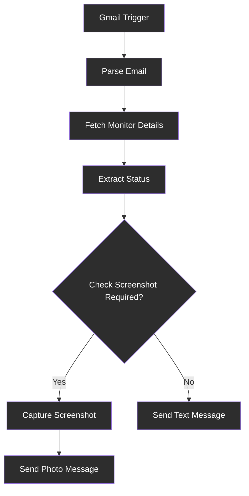

# UptimeRobot Alerts to Telegram with Visual Verification
## 🎯 Purpose
The purpose of this workflow is to automate the process of receiving, processing, and responding to UptimeRobot monitoring alerts. It enhances traditional email notifications by converting them into rich Telegram messages with optional visual verification through website screenshots, enabling faster incident response and improved situational awareness for monitoring teams.
## 👥 Target audience
This workflow is targeted at IT professionals, system administrators, DevOps engineers, and website operators who use UptimeRobot for uptime monitoring. It is suitable for individuals or teams seeking to streamline alert management with integrated visual evidence and real-time messaging capabilities.
## 🔄 Overview
The workflow operates on a polling basis, checking Gmail for new UptimeRobot alert emails. Upon detection, it parses the email content to extract key identifiers, queries the UptimeRobot API for detailed monitor status, and formats the information. A conditional branch determines if a screenshot is required; if enabled, it captures a visual of the website and sends a photo message to Telegram, otherwise it sends a text-only message. This design ensures reliable notification delivery with graceful degradation if optional features fail.

# 📝 How-to Guide
## Step by step
1. **Prepare Accounts**: Ensure you have active accounts with Gmail, UptimeRobot, Telegram, and optionally ScreenshotMachine.
2. **Set Up n8n Credentials**: In n8n, create credentials for Gmail (OAuth2), UptimeRobot (API key), Telegram (bot token), and ScreenshotMachine (HTTP Query Auth if used).
3. **Import and Configure Workflow**: Import the workflow JSON, then update the 'Conf' node with your specific parameters like 'take_screenshot', 'screenshotmachine_device', and 'chatId'.
4. **Test Trigger and Nodes**: Manually trigger the Gmail node to verify email parsing, check UptimeRobot API response, and confirm Telegram message formatting.
5. **Activate and Monitor**: Activate the workflow; it will run automatically every 5 minutes. Monitor initial alerts to ensure all nodes execute correctly and adjust settings as needed.
## 🔄 Conditional Paths
The workflow includes a key conditional branch at the 'If Screenshot Required' node:
- **Screenshot Path**: If 'take_screenshot' is true, it proceeds to generate an API hash, capture a screenshot via HTTP request, and send a photo message to Telegram.
- **Text-Only Path**: If 'take_screenshot' is false or screenshot capture fails, it directly sends a text message with status details. This ensures notifications are always delivered even if optional features encounter issues.
## ✅ Success Criteria
**Verification Steps**:
- Receive a Telegram message with formatted monitor status, timestamp, and reason within minutes of a UptimeRobot alert.
- If screenshots are enabled, confirm the image is attached and displays the website correctly.
- Check n8n execution logs for any errors in email parsing, API calls, or message sending; resolve any credential or configuration issues promptly.

# Reference
## 🔧 Technical Specifications
**Workflow Components**:
- **Trigger**: Gmail node polling every 5 minutes for emails from alert@uptimerobot.com
- **Data Processing**: Regex-based extraction, UptimeRobot API integration, status mapping, and timestamp conversion
- **Output**: Telegram API nodes for sending messages and optional screenshots
- **Error Handling**: Continue on error for non-critical nodes to ensure notification delivery

** ⚙️ Key Configuration Parameters**:
- take_screenshot: Boolean to enable/disable screenshot functionality
- screenshotmachine_device: String specifying device type (e.g., desktop)
- screenshotmachine_dimension: String for screenshot size (e.g., 1366xfull)
- screenshotmachine_format: String for image format (e.g., png)
## 📊 Input/Output
**Input Parameters**:
| Attribute | Data Type | Description |
|-----------|-----------|-------------|
| Email Subject | String | Subject line of the UptimeRobot alert email |
| Email Body | String | Full text content of the email containing monitor details |
| Monitor ID | String | 9-digit identifier extracted using regex patterns |
| Monitor URL | String | Website URL extracted from the email body |

**Output Parameters**:
| Attribute | Data Type | Description |
|-----------|-----------|-------------|
| Status Message | String | Formatted text sent to Telegram with monitor status, last change time, and reason |
| Screenshot Image | Binary | Optional image data captured from the website, included in photo messages |
| Telegram Chat ID | String | Identifier for the target Telegram chat or channel where messages are sent |
## 🔗 Dependencies
**External Services**:
- Gmail for receiving UptimeRobot email alerts
- UptimeRobot API for fetching monitor status details
- Telegram Bot API for sending notifications
- ScreenshotMachine API for capturing website screenshots (conditional)

**n8n Credentials**:
- Gmail OAuth2 for email access
- UptimeRobot API key for monitor data
- Telegram bot token for messaging
- HTTP Query Auth for ScreenshotMachine API calls

# Tutorial
## 🧠 Learning Path
**Progressive Learning Steps**:
1. **Understand Basics**: Start by exploring how n8n workflows handle triggers and data flow using the Gmail and UptimeRobot nodes.
2. **Analyze Data Transformation**: Examine the regex patterns and API responses to see how raw email data is converted into structured information.
3. **Experiment with Conditionals**: Modify the 'take_screenshot' setting to observe how the workflow branches and handles different paths.
4. **Integrate Customizations**: Add a new node, such as a logger or another messaging service, to extend functionality and reinforce understanding of node connections.

## 💡 Practice Exercises
**Hands-On Activities**:
- **Exercise 1**: Change the polling interval in the Gmail trigger to 1 minute and monitor how it affects alert responsiveness.
- **Exercise 2**: Modify the Telegram message format to include additional fields like monitor name or response time, testing your changes with a mock alert.
- **Exercise 3**: Disable the screenshot feature and add a fallback node to send a duplicate alert to another service like email or Slack, ensuring you handle errors gracefully.
- **Exercise 4**: Use the workflow's error handling to simulate a ScreenshotMachine API failure and verify that text-only messages are still delivered successfully.
