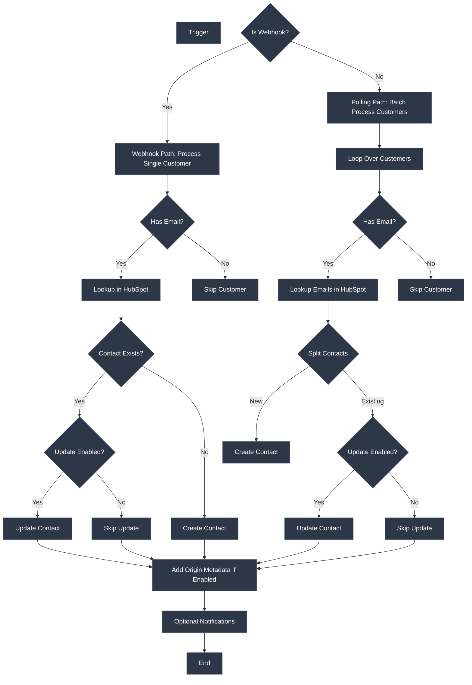

# WooCommerce-HubSpot Customer Sync
## Purpose
This workflow automates the synchronization of customer data from WooCommerce to HubSpot CRM, ensuring consistency across platforms. It supports real-time updates via webhooks and scheduled batch processing, with features like duplicate prevention, configurable update rules, and error resilience to handle API limitations and data inconsistencies.
## Target audience
E-commerce managers, store administrators, and marketing professionals who need to integrate WooCommerce customer data with HubSpot for improved CRM, marketing automation, and customer insights. Basic familiarity with n8n, WooCommerce, and HubSpot is assumed.
## Overview
The workflow starts with triggers: webhooks for real-time sync or schedules for batch processing. Customer data is extracted, validated for email presence, and matched against existing HubSpot contacts. Based on configuration, new contacts are created or existing ones are updated, with optional origin metadata added. Conditional logic handles errors and decisions, while batch processing manages large datasets efficiently.

# How-to Guide
## Step by step
1. **Prepare Platforms**: Ensure WooCommerce REST API is enabled and HubSpot API access is granted.
2. **Import Workflow**: Load the workflow into your n8n instance.
3. **Configure Credentials**: Add WooCommerce and HubSpot credentials in n8n settings.
4. **Set Up Webhook**: In WooCommerce, create a webhook for 'Customer Created' events with the n8n webhook URL.
5. **Adjust Configuration**: Update the Conf node with desired sync settings (e.g., enable origin tracking).
6. **Activate Workflow**: Start the workflow and test with a manual trigger or wait for webhook events.
7. **Monitor Results**: Check HubSpot contacts and n8n execution logs for sync status and errors.
## Conditional Paths
- **Webhook vs Polling**: If triggered by webhook, process a single customer; if by schedule, batch process all customers.
- **Email Validation**: Customers without emails are skipped to avoid HubSpot errors.
- **Contact Existence**: If a contact exists in HubSpot, update only if `update_existing_contacts` is enabled; otherwise, skip.
- **Metadata Tracking**: Origin data is added only if `sync_origin_metadata` is enabled.
- **Error Handling**: Failed operations log errors but allow the workflow to continue processing other customers.
## Success Criteria
- Contacts are created or updated in HubSpot matching WooCommerce customer data.
- No critical errors halt the workflow; individual failures are logged and skipped.
- Optional notifications confirm workflow start and completion.
- Sync summary shows expected counts of processed, created, and updated contacts.

# Reference
## Technical Specifications
The workflow utilizes n8n nodes for WooCommerce (v3 REST API) and HubSpot (CRM API). It handles API rate limiting through batch processing and includes error continuation settings. Required endpoints include WooCommerce customers list and webhooks, and HubSpot contacts search and update.
## Input/Output
### Input Parameters
| Attribute | Data Type | Description |
|-----------|-----------|-------------|
| sync_origin_metadata | boolean | Controls whether to track the WooCommerce domain in HubSpot custom properties (origin_site, origin_id) |
| update_existing_contacts | boolean | Determines if existing HubSpot contacts should be updated when matches are found |
| notifications | boolean | Enables or disables workflow start and end notifications |

### Output Parameters
| Attribute | Data Type | Description |
|-----------|-----------|-------------|
| sync_summary | object | Summary of sync operations including counts of created, updated, and skipped contacts |
| error_logs | array | List of error details encountered during customer processing, including customer data and error messages |
## Dependencies
- **Credentials**: WooCommerce API credentials (consumer key and secret), HubSpot app token.
- **External Services**: WooCommerce webhook setup for real-time sync, HubSpot custom properties for origin tracking.
- **n8n Nodes**: WooCommerce Trigger, Get all WooCommerce customers, HubSpot Create or update a Contact, and related data processing nodes.

# Tutorial
## Learning Path
Begin by understanding the trigger mechanisms: webhook for instant sync and schedule for bulk updates. Explore how data flows through extraction, matching, and HubSpot operations. Practice modifying configuration settings to see changes in sync behavior, and analyze error handling by simulating invalid data.

## Practice Exercises
1. **Test Real-Time Sync**: Create a new customer in WooCommerce and verify the contact appears in HubSpot via webhook.
2. **Batch Sync Experiment**: Use the manual trigger to sync all existing customers and check for duplicates or updates.
3. **Customize Settings**: Disable `update_existing_contacts` and observe that existing HubSpot contacts are not modified.
4. **Error Simulation**: Provide a customer without an email and confirm it is skipped without breaking the workflow.
5. **Add Notifications**: Enable notifications and verify alerts are sent for workflow start and end events.