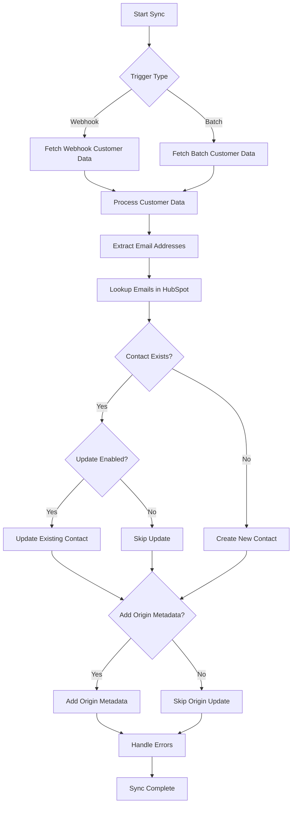

# WooCommerce-HubSpot Customer Sync
## Purpose
🚀 The purpose of this workflow is to automate the synchronization of customer data from WooCommerce to HubSpot, ensuring that contact information is consistently updated across both platforms. It eliminates manual data entry, reduces errors, and supports both real-time and batch processing for comprehensive customer management.
## Target audience
🎯 This workflow is ideal for e-commerce businesses, marketing professionals, and developers who manage WooCommerce stores and use HubSpot for CRM, sales, and marketing automation. It requires basic familiarity with n8n, API integrations, and platform configurations.
## Overview
📊 The workflow operates through two primary execution paths: a real-time webhook trigger that syncs data immediately when a new customer is created in WooCommerce, and a batch trigger that periodically processes all customers. Key concepts include duplicate detection using email addresses, configurable update behavior for existing contacts, origin tracking for identifying the source store, and integrated error handling to maintain reliability. Data flows from WooCommerce through processing nodes to HubSpot, with conditional logic routing based on existence and settings.

# How-to Guide
## Step by step
📝 Follow these steps to implement the workflow:

1. **Prepare Platforms**: Ensure WooCommerce has REST API access and webhooks enabled, and HubSpot has the necessary custom properties created.
2. **Import Workflow**: Import the workflow JSON into your n8n instance.
3. **Configure Credentials**: Add WooCommerce API credentials (consumer key and secret) and HubSpot app token in n8n's credential management.
4. **Set Configuration**: Open the 'Conf' node and adjust parameters:
   - `sync_origin_metadata`: Set to true if tracking WooCommerce site origin.
   - `update_existing_contacts`: Set to true to update existing HubSpot contacts.
   - `notifications`: Enable for start/end alerts.
5. **Webhook Setup**: In WooCommerce, add a webhook for 'customer.created' events using the URL from the WooCommerce Trigger node.
6. **Test Execution**: Use the manual trigger to run a sync and check HubSpot for new or updated contacts.
7. **Schedule Batch Sync**: Configure the schedule trigger node for automatic intervals (e.g., every 24 hours).
## Conditional Paths
🔄 The workflow includes several conditional paths:
- **Trigger Type**: Routes based on webhook (real-time) or batch (scheduled/manual) execution.
- **Contact Existence**: Checks if a contact already exists in HubSpot; if yes, it may update or skip based on settings.
- **Update Settings**: Controls whether existing contacts are updated or left unchanged.
- **Origin Metadata**: Decides if additional properties like origin site and ID are synced to HubSpot.
- **Email Validation**: Ensures only customers with valid emails are processed to avoid errors.
## Success Criteria
✅ Successful execution is confirmed when:
- Contacts are created or updated in HubSpot without errors.
- Error handling nodes show no captured failures in the execution log.
- Notifications (if enabled) are sent indicating start and completion.
- Data in HubSpot matches WooCommerce customer records, including optional origin metadata.

# Reference
## Technical Specifications
🔧 The workflow comprises 35 nodes organized into functional groups: triggers (webhook, schedule, manual), configuration, data processing, conditional logic, HubSpot integration, error handling, and notifications. Key technical aspects include:
- **APIs Used**: WooCommerce REST API for customer data, HubSpot Contacts API for CRUD operations.
- **Data Flow**: WooCommerce customer data is transformed and mapped to HubSpot contact properties.
- **Error Handling**: Nodes configured with 'continueErrorOutput' to ensure workflow progression despite individual failures.
- **Configuration-Driven**: Behavior is controlled via central configuration node settings.
## Input/Output
📥 **Input Parameters Table**:
| Attribute | Data Type | Description |
|-----------|-----------|-------------|
| email | string | Primary email address of the WooCommerce customer used for matching. |
| first_name | string | Customer's first name from WooCommerce billing details. |
| last_name | string | Customer's last name from WooCommerce billing details. |
| billing_address | object | Complete billing address object including street, city, etc. |
| origin_site | string | WooCommerce site domain for origin tracking (if enabled). |

📤 **Output Parameters Table**:
| Attribute | Data Type | Description |
|-----------|-----------|-------------|
| contact_id | string | Unique identifier of the HubSpot contact after sync. |
| status | string | Operation result: 'created', 'updated', 'skipped', or 'error'. |
| error_message | string | Detailed error information if the sync operation failed. |
## Dependencies
🔗 **External Dependencies**:
- WooCommerce REST API with webhook support for customer.created events.
- HubSpot Contacts API with app token or OAuth2 authentication.
- Custom properties in HubSpot: 'origin_site' and 'origin_id' must exist if origin tracking is enabled.

**n8n Dependencies**:
- WooCommerce API credentials stored in n8n.
- HubSpot app token credentials stored in n8n.
- Configuration settings in the 'Conf' node for workflow behavior.

# Tutorial
## Learning Path
🧭 Start with the basics: understand the trigger mechanisms and data flow. Progress to conditional logic and error handling. Advanced topics include customizing data mapping and integrating notifications. Practice by modifying settings and observing outcomes in HubSpot.

## Practice Exercises
🏋️ **Exercises to reinforce learning**:
1. **Test Manual Sync**: Use the manual trigger to sync a single customer and verify the contact in HubSpot.
2. **Configure Updates**: Change 'update_existing_contacts' to false and run a sync to see how existing contacts are skipped.
3. **Simulate Errors**: Temporarily invalidate HubSpot credentials to trigger error handling and review captured error details.
4. **Add Notification**: Integrate an email node to send a confirmation message after sync completion.