# WooCommerce-HubSpot Customer Sync (Polling)
## Purpose
This workflow automates the synchronization of customer data from WooCommerce to HubSpot, ensuring that contact information is consistently updated in the CRM. It supports both scheduled and manual execution, handles detection of new versus existing contacts, and includes configurable options for tracking origin metadata, updating existing contacts, and sending notifications. The primary goal is to reduce manual data entry, improve data accuracy, and enhance customer engagement through timely updates.
## Target audience
E-commerce managers, digital marketers, and developers responsible for managing customer data across platforms. Users should have basic knowledge of WooCommerce and HubSpot setups, as well as familiarity with n8n for workflow automation. It is suitable for small to medium-sized businesses seeking to streamline their CRM integration processes.
## Overview
The workflow begins with triggers that initiate data fetching from WooCommerce. Customer data is processed to extract emails and match them with existing HubSpot contacts. Based on configuration, new contacts are created, and existing ones are updated if allowed. The process includes validation for email addresses, optional addition of origin metadata, and error handling to manage failures gracefully. Notifications can be triggered upon completion or errors, providing visibility into the sync process.

```mermaid
  flowchart TD
    A[📅 Trigger] --> B[⚙️ Configuration]
    B --> C[🛒 Fetch WooCommerce Customers]
    C --> D[🔍 Process & Match Contacts]
    D --> E{New or Existing?}
    E -->|New| F[➕ Create New Contacts]
    E -->|Existing| G{Update Enabled?}
    G -->|Yes| H[🔄 Update Existing Contacts]
    G -->|No| I[⏭️ Skip Update]
    F --> J[🔄 Sync Contacts]
    H --> J
    I --> J
    J --> K{Email Valid?}
    K -->|Yes| L[📧 Create/Update in HubSpot]
    K -->|No| M[❌ Skip Invalid]
    L --> N{Metadata Enabled?}
    N -->|Yes| O[🏷️ Add Origin Metadata]
    N -->|No| P[⏭️ Skip Metadata]
    O --> Q[✅ Completion]
    P --> Q
    M --> Q
    Q --> R[📢 Notifications]
    style A fill:#2E8B57,color:white
    style B fill:#4682B4,color:white
    style C fill:#4682B4,color:white
    style D fill:#FFA500,color:black
    style E fill:#FF6347,color:white
    style F fill:#32CD32,color:black
    style G fill:#FF6347,color:white
    style H fill:#4682B4,color:white
    style I fill:#808080,color:white
    style J fill:#FFA500,color:black
    style K fill:#FF6347,color:white
    style L fill:#4682B4,color:white
    style M fill:#808080,color:white
    style N fill:#FF6347,color:white
    style O fill:#4682B4,color:white
    style P fill:#808080,color:white
    style Q fill:#2E8B57,color:white
    style R fill:#FFD700,color:black
```

# How-to Guide
## Step by step
## 🛠️ Step-by-Step Setup Guide
1. **Prepare Credentials**: Obtain WooCommerce API credentials (Consumer Key and Secret) and a HubSpot App Token.
2. **Import Workflow**: Import the workflow into n8n and open it for editing.
3. **Configure Nodes**:
   - In the 'Set Domain' node, enter your WooCommerce site domain.
   - In the 'Conf' node, set boolean flags for sync_origin_metadata, update_existing_contacts, and notifications as needed.
4. **Set Credentials**: Assign the WooCommerce and HubSpot credentials to the respective nodes.
5. **Test Execution**: Use the Manual Trigger to run the workflow and verify that customers are synced correctly.
6. **Schedule Automation**: Adjust the Schedule Trigger node to define how often the sync should occur (e.g., daily or hourly).
7. **Monitor Outputs**: Check the workflow executions for any errors and review synced data in HubSpot.
## Conditional Paths
## 🔀 Conditional Paths Explained
- **New vs Existing Contacts**: After email lookup, contacts are split into new (no match in HubSpot) and existing (match found) streams. Existing contacts only proceed to update if update_existing_contacts is enabled in configuration.
- **Email Validation**: Contacts without valid email addresses are skipped to prevent sync failures.
- **Origin Metadata**: If sync_origin_metadata is enabled, origin_site and origin_id properties are added to contacts in HubSpot; otherwise, this step is bypassed.
- **Error Handling**: Errors in contact sync are captured and logged, allowing the workflow to continue processing other records without stopping entirely.
## Success Criteria
## ✅ Success Criteria
- All valid WooCommerce customers are successfully created or updated in HubSpot without errors.
- Origin metadata is added to contacts if enabled, visible in HubSpot contact properties.
- Notifications are sent as configured, confirming completion or alerting on issues.
- Error logs are empty or contain only expected skips (e.g., missing emails), with no critical API failures.

# Reference
## Technical Specifications
## 📋 Technical Specifications
- **Workflow Type**: Data synchronization and automation.
- **Execution Modes**: Scheduled (interval-based) and manual triggering.
- **API Endpoints Used**:
  - WooCommerce: /wp-json/wc/v3/customers for fetching customer data.
  - HubSpot: /crm/v3/objects/contacts/search for email lookup, and contact creation/update endpoints.
- **Data Mapping**: WooCommerce customer fields (e.g., email, name, address) are mapped to corresponding HubSpot contact properties.
- **Error Handling Strategy**: Continuous error output with detailed logging; batch processing resilient to individual failures.
## Input/Output
## 🔄 Input and Output Parameters
### Input Parameters Table
| Attribute | Data Type | Description |
|-----------|-----------|-------------|
| domain | string | The domain of the WooCommerce site to fetch customers from. |
| sync_origin_metadata | boolean | Flag to enable or disable tracking of origin metadata (origin_site, origin_id) in HubSpot. |
| update_existing_contacts | boolean | Flag to allow updates to existing HubSpot contacts if matches are found. |
| notifications | boolean | Flag to enable or disable notification triggers upon workflow completion or errors. |

### Output Parameters Table
| Attribute | Data Type | Description |
|-----------|-----------|-------------|
| synced_contacts | array | List of contact objects that were successfully created or updated in HubSpot. |
| error_details | array | List of error objects containing details on failures, such as customer data and error messages. |
| notification_status | string | Status of notifications sent, if enabled (e.g., success or failure). |
## Dependencies
## 🔗 Dependencies
- **Credential Dependencies**: WooCommerce API credentials (wooCommerceApi) and HubSpot App Token credentials (hubspotAppToken) must be configured in n8n.
- **External Dependencies**: Access to WooCommerce REST API and HubSpot CRM API endpoints; custom HubSpot properties (origin_site, origin_id) are required if sync_origin_metadata is enabled.
- **Configuration Dependencies**: Domain setting in 'Set Domain' node and configuration flags in 'Conf' node must be properly set for desired behavior.

# Tutorial
## Learning Path
## 🎓 Learning Path
1. **Start with Basics**: Familiarize yourself with n8n interfaces and node configurations by exploring simple workflows.
2. **Understand APIs**: Learn about WooCommerce and HubSpot API structures to comprehend data mapping and error handling.
3. **Explore This Workflow**: Import the workflow and run it in a test environment to observe data flow and node interactions.
4. **Experiment with Modifications**: Try adjusting configuration flags or adding custom nodes to extend functionality, such as filtering specific customer groups.
5. **Integrate with Real Data**: Deploy the workflow in a live setup and monitor its performance over time, refining as needed.

## Practice Exercises
## 🏋️ Practice Exercises
- **Exercise 1**: Modify the workflow to sync only customers from a specific WooCommerce user role (e.g., 'subscriber') by adding a filter node after fetching customers.
- **Exercise 2**: Enable notifications and set up an email or Slack alert that triggers when the workflow encounters more than 5 errors in a single run.
- **Exercise 3**: Customize the origin metadata by adding a new custom property in HubSpot and updating the workflow to include additional data, such as the customer's registration date.
- **Exercise 4**: Test error handling by temporarily invalidating API credentials and observing how the workflow logs and continues processing.