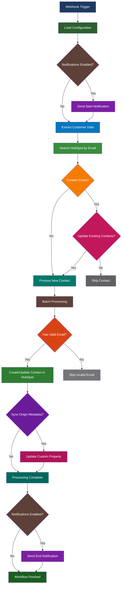

# WooCommerce-HubSpot Customer Sync (Webhook)
## Purpose
This workflow automates the real-time synchronization of customer data from WooCommerce to HubSpot, ensuring that new customers are promptly added or updated in the CRM. It reduces manual data entry, improves data accuracy, and supports configurable options for updating existing contacts, tracking origin metadata, and sending notifications.
## Target audience
E-commerce managers, marketing professionals, and developers who manage customer relationships across WooCommerce and HubSpot platforms. Users should have basic knowledge of webhooks, API integrations, and n8n workflow configuration.
## Overview
The workflow is triggered by WooCommerce webhook events for new customer creations. It loads configuration settings to control behavior, extracts customer data, performs lookups in HubSpot, and conditionally processes contacts based on email existence and update preferences. Error handling ensures robustness by capturing failures, and optional features like metadata sync and notifications enhance functionality.

# How-to Guide
## Step by step
1. 🏗️ Set up the WooCommerce webhook: In your WooCommerce admin, go to Advanced > Webhooks, create a new webhook for 'Customer created' events, and set the delivery URL to the webhook URL provided by this n8n workflow.
2. 🔐 Configure credentials: In n8n, add WooCommerce API credentials (store URL, consumer key, consumer secret) and HubSpot app token credentials.
3. ⚙️ Adjust configuration: Open the Conf node and set the boolean flags—sync_origin_metadata, update_existing_contacts, notifications—to true or false based on your requirements.
4. 🧪 Test the workflow: Activate the workflow in n8n, create a test customer in WooCommerce, and check HubSpot to verify the contact is created or updated correctly.
5. 📈 Monitor performance: Use n8n's execution list to review workflow runs and ensure no errors occur during synchronization.
## Conditional Paths
🔀 If update_existing_contacts is disabled, existing HubSpot contacts are skipped, and only new contacts are created.
🔀 If sync_origin_metadata is enabled, the 'origin_site' custom property is updated in HubSpot only if it is currently empty.
🔀 Notifications for workflow start and end are sent only if the notifications flag is enabled in the Conf node.
🔀 Customers without valid email addresses are skipped during processing to avoid errors.
## Success Criteria
✅ A contact is successfully created or updated in HubSpot with the correct customer data from WooCommerce.
✅ No errors are recorded in the n8n execution logs for the contact synchronization process.
✅ If enabled, notifications are delivered without issues, and origin metadata is added as specified.

# Reference
## Technical Specifications
This workflow uses n8n nodes including Webhook, Configuration, IF conditions, Data Extraction, HubSpot Lookup, Loop, Validation, Contact Creation/Update, and Error Handling. It leverages WooCommerce REST API for webhook events and HubSpot CRM API for contact management. The workflow is designed for real-time processing with configurable error handling to continue on failures.
## Input/Output
## Input Parameters
| Attribute | Data Type | Description |
|-----------|-----------|-------------|
| email | string | Customer email address from WooCommerce webhook payload |
| first_name | string | Customer first name from WooCommerce |
| last_name | string | Customer last name from WooCommerce |
| billing_address | object | Billing address details including street, city, and country |
| id | integer | Unique customer ID from WooCommerce |

## Output Parameters
| Attribute | Data Type | Description |
|-----------|-----------|-------------|
| id | string | HubSpot contact ID generated upon creation or update |
| properties | object | Contact properties mapped from WooCommerce, such as name, email, and lifecycle stage |
| error_message | string | Details of any errors encountered during contact processing |
| origin_site | string | Custom property value set if sync_origin_metadata is enabled |
## Dependencies
🔗 WooCommerce API credentials must be valid and have permissions to access customer data.
🔗 HubSpot app token must have sufficient scopes to create and update contacts.
🔗 WooCommerce webhook must be correctly configured and accessible for event delivery.
🔗 If sync_origin_metadata is used, the 'origin_site' custom property must exist in the HubSpot account.
🔗 n8n instance must have network access to both WooCommerce and HubSpot APIs.

# Tutorial
## Learning Path
🧭 Begin by understanding webhook basics and how they trigger workflows in n8n.
🧭 Explore the WooCommerce and HubSpot node configurations in n8n to familiarize yourself with data mapping.
🧭 Practice with simple sync workflows before customizing this template for advanced use cases.
🧭 Refer to n8n documentation for error handling and node-specific settings to deepen your knowledge.

## Practice Exercises
🛠️ Modify the workflow to sync additional customer fields like phone number or company details from WooCommerce to HubSpot.
🛠️ Add a node to send a personalized welcome email via HubSpot after contact creation.
🛠️ Test error scenarios by intentionally providing invalid email addresses in WooCommerce and observe how the workflow handles them.
🛠️ Implement a fallback mechanism, such as a retry logic, for failed contact updates using n8n's error handling features.