# WooCommerce-HubSpot Orders Sync
## Purpose
🎯 The purpose of this workflow is to automate the synchronization of order data from WooCommerce to HubSpot CRM, ensuring that sales information, customer details, and product associations are consistently and accurately reflected in the CRM system. This eliminates manual data entry, reduces errors, and provides real-time insights into customer purchases and behavior.
## Target audience
👥 This workflow is targeted at e-commerce businesses using WooCommerce for their online store and HubSpot for CRM management. It is suitable for store administrators, CRM managers, and automation specialists who need to maintain data integrity across platforms without manual intervention.
## Overview
🔄 The workflow operates through three main trigger paths: manual execution, real-time WooCommerce webhooks, and scheduled batch processing. It fetches orders from WooCommerce, checks for existing records in HubSpot, associates customers via email lookup, transforms data fields, and creates orders with line items in HubSpot. Key concepts include duplicate prevention, data mapping, and conditional processing based on customer and product availability.

```mermaid
  %%{init: {'theme': 'dark', 'themeVariables': { 'primaryColor': '#0d1117', 'primaryTextColor': '#ffffff', 'primaryBorderColor': '#30363d', 'lineColor': '#8b949e', 'tertiaryColor': '#161b22'}}}%%
flowchart TD
    A[🔄 Trigger Events] --> B{Trigger Type?}
    B -->|Manual| C[📥 Fetch WooCommerce Orders]
    B -->|Real-time| C
    B -->|Scheduled| D[🔄 Batch Order Lookup]
    D --> C
    C --> E{Order Exists in HubSpot?}
    E -->|No| F[👤 Customer Lookup & Association]
    E -->|Yes| G[⏭️ Skip Sync]
    F --> H[📊 Data Transformation & Mapping]
    H --> I{Valid Customer Data?}
    I -->|Yes| J[🛍️ Create HubSpot Order]
    I -->|No| K[❌ Abort Order Creation]
    J --> L[📦 Process Line Items & Products]
    L --> M[✅ Sync Complete]
```

# How-to Guide
## Step by step
📝 To deploy and run this workflow:
1. **Prepare Credentials**: Obtain WooCommerce API keys and HubSpot app token.
2. **Import Workflow**: Load the template into your n8n instance.
3. **Configure Nodes**: Update credential fields in WooCommerce and HubSpot nodes with your API details.
4. **Set Triggers**: Choose and enable desired triggers (manual, webhook, or schedule).
5. **Validate Data Flow**: Execute manually with a test order to verify synchronization.
6. **Monitor Execution**: Use n8n's execution history to track successes and errors.
## Conditional Paths
🔄 The workflow includes several conditional paths:
- **Order Existence Check**: Filters out orders already present in HubSpot to avoid duplicates.
- **Customer Association**: Only proceeds with order creation if valid customer data is found or created.
- **Product Matching**: Handles cases where products may not exist in HubSpot, with fallback logic for variant IDs.
- **Error Handling**: Conditional nodes abort processes when critical data is missing, preventing API errors.
## Success Criteria
✅ A successful synchronization is indicated by:
- Orders appearing in HubSpot with correct details and line items.
- Customer contacts associated with orders in HubSpot.
- No duplicate orders created in HubSpot.
- All line items accurately reflected with product associations.
- Workflow executions completing without errors in n8n's logs.

# Reference
## Technical Specifications
🔧 Technical details:
- **Workflow Nodes**: 40 nodes organized into trigger, processing, transformation, and API groups.
- **API Endpoints**: WooCommerce REST API (orders, customers) and HubSpot CRM API (orders, contacts, line items).
- **Execution Modes**: Manual, real-time webhook, and scheduled (12-month intervals).
- **Data Processing**: Supports batch and individual order processing with merge and split operations.

| Attribute | Data Type | Description |
|-----------|-----------|-------------|
| WooCommerce Order ID | Integer | Unique identifier for the order in WooCommerce |
| Customer Email | String | Email address of the customer for contact lookup |
| Order Total | Number | Total amount of the order including taxes and shipping |
| Line Items | Array | List of products and quantities in the order |

| Attribute | Data Type | Description |
|-----------|-----------|-------------|
| HubSpot Order ID | String | Unique identifier for the created order in HubSpot |
| Sync Status | String | Indicates success or failure of the synchronization |
| Associated Contact ID | String | HubSpot contact ID linked to the order |
| Line Item Count | Integer | Number of line items successfully created |
## Input/Output
📥 Input parameters and 📤 outputs are defined in the tables above. Key inputs include WooCommerce order data and customer information, while outputs consist of HubSpot order IDs and synchronization status. The workflow transforms raw order data into structured HubSpot properties through mapping nodes.
## Dependencies
🔗 Dependencies include:
- **Credentials**: WooCommerce API credentials (consumer key and secret) and HubSpot app token.
- **External APIs**: WooCommerce REST API and HubSpot CRM API must be accessible.
- **n8n Nodes**: Relies on HTTP Request, Merge, Split, and Conditional nodes for data processing.
- **Data Schema**: Assumes standard WooCommerce order and HubSpot property structures.

# Tutorial
## Learning Path
🎓 To master this workflow:
1. **Start with Basics**: Understand WooCommerce order structure and HubSpot object properties.
2. **Explore Triggers**: Experiment with different trigger types to see how they initiate the workflow.
3. **Analyze Data Flow**: Trace how order data moves through nodes, focusing on transformation steps.
4. **Test Conditions**: Modify test data to trigger conditional paths and observe outcomes.
5. **Customize Mapping**: Practice adjusting field mappings to include additional order attributes.

## Practice Exercises
🏋️ Practice exercises:
- **Exercise 1**: Create a test order in WooCommerce and manually execute the workflow to observe the full sync process.
- **Exercise 2**: Modify the customer lookup logic to handle cases where email addresses are missing.
- **Exercise 3**: Add a notification node to send an alert when order synchronization fails.
- **Exercise 4**: Extend the product matching to include custom product metadata from WooCommerce.