# WooCommerce-HubSpot Orders Sync (Polling)
## Purpose
## 🎯 Purpose

This workflow serves as an automated bridge between WooCommerce and HubSpot CRM, eliminating manual data entry and ensuring real-time synchronization of customer and order information. The primary purpose is to maintain accurate customer profiles in HubSpot based on WooCommerce purchase behavior, create comprehensive deal records for each order, and establish proper product associations for complete sales tracking and reporting.
## Target audience
## 👥 Target Audience

This solution is specifically designed for:

- **E-commerce Managers** responsible for maintaining customer data across platforms
- **Marketing Teams** needing accurate customer purchase history for segmentation and personalization
- **Sales Operations** professionals requiring complete order visibility in their CRM
- **Business Owners** seeking to automate data synchronization between their store and CRM
- **Technical Administrators** managing integration workflows between business systems
## Overview
## 🧠 Conceptual Overview

The workflow operates on a multi-stage synchronization model that ensures data integrity and prevents duplicates. It begins by fetching customer data from WooCommerce, applies business logic to filter qualified customers, then processes their order history. Each order undergoes duplicate checking before creation in HubSpot, with associated products being matched and line items created in batches. The system maintains referential integrity by using WooCommerce IDs as external references in HubSpot, enabling reliable updates and preventing data corruption during subsequent synchronizations.

```mermaid
  graph TD
    A[🔄 Manual Trigger] --> B[👥 Fetch WooCommerce Customers]
    B --> C[📊 Process Customer Data]
    C --> D{❓ Customer Eligible?<br/>lifetime_total > 90}
    D -->|✅ Yes| E[👤 Create/Update HubSpot Contact]
    D -->|❌ No| F[⏭️ Skip Contact Creation]
    E --> G[📦 Fetch Customer Orders]
    F --> G
    G --> H[🔄 Process Orders]
    H --> I{❓ Order Exists in HubSpot?}
    I -->|❌ No| J[💼 Create HubSpot Order]
    I -->|✅ Yes| K[⏭️ Skip Order Creation]
    J --> L[📋 Extract Line Items]
    L --> M[🔍 Find Matching HubSpot Products]
    M --> N[📦 Create HubSpot Line Items]
    K --> H
    
    classDef darkNode fill:#2d3748,stroke:#4a5568,color:#ffffff,stroke-width:2px
    class A,B,C,D,E,F,G,H,I,J,K,L,M,N darkNode
    linkStyle default stroke:#ffffff,stroke-width:2px
```

# How-to Guide
## Step by step
## 🛠️ Step-by-Step Setup Guide

### Phase 1: Platform Preparation

1. **Configure WooCommerce API**
   - Navigate to WooCommerce Settings > Advanced > REST API
   - Generate new consumer key with read permissions
   - Note the consumer key and consumer secret

2. **Set Up HubSpot Private App**
   - Go to HubSpot Settings > Integrations > Private Apps
   - Create new private app with required scopes
   - Copy the generated access token

### Phase 2: Workflow Configuration

3. **Add Credentials to n8n**
   - Create WooCommerce credential with your site URL, consumer key, and secret
   - Set up HubSpot credential using the private app token
   - Test both credentials to ensure proper authentication

4. **Configure Workflow Parameters**
   - Update Conf node with your specific WooCommerce site URL
   - Set appropriate days parameter for order history range
   - Configure issue_coupons based on your business logic

### Phase 3: Validation and Testing

5. **Execute Test Run**
   - Use manual trigger to initiate workflow
   - Monitor execution through n8n execution log
   - Verify created contacts and deals in HubSpot
   - Check for proper line item associations

6. **Schedule Automation**
   - Replace manual trigger with schedule trigger if desired
   - Set appropriate frequency based on order volume
   - Configure error notifications for failed synchronizations
## Conditional Paths
## 🔀 Conditional Paths

### Customer Eligibility Branch

- **Path A (Eligible Customers)**: Customers with lifetime order value exceeding $90 proceed to contact creation/update in HubSpot, followed by order processing
- **Path B (Ineligible Customers)**: Customers below the threshold skip contact creation but their orders still process through the order synchronization pipeline

### Order Duplicate Check

- **Path C (New Orders)**: Orders not found in HubSpot proceed through the complete creation workflow including deal creation, product matching, and line item generation
- **Path D (Existing Orders)**: Orders already present in HubSpot skip the creation process to prevent duplicates while continuing to process remaining orders

### Product Matching Logic

- **Path E (Variation Products)**: Line items with variation_id use the variation ID for product matching in HubSpot
- **Path F (Simple Products)**: Line items without variation_id fall back to using the product_id for matching
## Success Criteria
## ✅ Success Criteria

**Immediate Verification Points:**

- 🟢 Workflow executes without errors in n8n execution history
- 🟢 HubSpot contacts created/updated with correct WooCommerce customer data
- 🟢 HubSpot deals generated with proper order amounts and dates
- 🟢 Line items associated correctly with HubSpot products
- 🟢 No duplicate contacts or deals created in HubSpot

**Business Validation Metrics:**

- 📊 Customer lifetime value accurately reflected in HubSpot contact properties
- 🔗 Proper associations maintained between contacts, deals, and products
- ⏱️ Synchronization completes within reasonable time for your data volume
- 📈 All eligible orders successfully transferred to HubSpot deals

# Reference
## Technical Specifications
## 🔧 Technical Specifications

**Workflow Architecture:**
- Total Nodes: 28
- Primary Trigger: Manual
- Execution Mode: Batch processing with loop operations
- Error Handling: Continue on error with conditional fallbacks

**API Integration Details:**
- WooCommerce REST API Version: v3
- HubSpot CRM API Version: v3
- Authentication: OAuth 1.0a (WooCommerce), Private App Token (HubSpot)
- Rate Limiting: Implemented through batch processing and loop controls

**Data Processing Characteristics:**
- Customer Processing: Sequential with eligibility filtering
- Order Handling: Parallel processing within batches
- Product Matching: Batch API calls for efficiency
- Memory Management: Item splitting and aggregation patterns
## Input/Output
## 📥 Input and Output Data

### Input Parameters Table

| Attribute | Data Type | Description |
|-----------|-----------|-------------|
| customer_id | Integer | Unique WooCommerce customer identifier |
| customer_email | String | Customer email address for contact matching |
| first_name | String | Customer first name from billing information |
| last_name | String | Customer last name from billing information |
| lifetime_total | Number | Calculated total order value across customer history |
| order_id | Integer | Unique WooCommerce order identifier |
| order_total | Number | Total amount for the specific order |
| order_date | DateTime | Date and time when order was placed |
| product_id | Integer | WooCommerce product identifier from line items |
| variation_id | Integer | WooCommerce variation identifier if applicable |
| quantity | Integer | Quantity of product in order line item |

### Output Parameters Table

| Attribute | Data Type | Description |
|-----------|-----------|-------------|
| hubspot_contact_id | String | Unique HubSpot contact identifier |
| contact_properties | Object | Complete HubSpot contact properties object |
| hubspot_deal_id | String | Unique HubSpot deal identifier |
| deal_properties | Object | Complete HubSpot deal properties object |
| line_item_ids | Array | Array of created HubSpot line item identifiers |
| product_associations | Array | Array of product-to-line-item associations |
| synchronization_timestamp | DateTime | Timestamp of successful synchronization |
| processed_orders_count | Integer | Number of orders successfully processed |
## Dependencies
## 🔗 Dependencies

**External Platform Dependencies:**
- WooCommerce Platform (version 4.0 or higher)
- HubSpot CRM with Sales Hub Professional
- Stable internet connectivity for API communications

**n8n Component Dependencies:**
- WooCommerce node (built-in n8n node)
- HubSpot node (built-in n8n node)
- Code node for custom JavaScript calculations
- If node for conditional logic routing
- SplitInBatches node for API rate limit management

**Configuration Dependencies:**
- Valid WooCommerce REST API credentials
- Active HubSpot private app token
- Properly configured association types in HubSpot
- Correct field mappings between platform properties

# Tutorial
## Learning Path
## 📚 Learning Path

### Foundation Stage (Week 1)
- Day 1-2: Understand basic WooCommerce customer and order data structures
- Day 3-4: Learn HubSpot contact, deal, and product object models
- Day 5-7: Practice with n8n basic nodes and data transformation

### Integration Stage (Week 2)
- Day 1-3: Study API authentication methods for both platforms
- Day 4-5: Learn about batch processing and rate limiting strategies
- Day 6-7: Practice with conditional logic and error handling in workflows

### Advanced Stage (Week 3)
- Day 1-2: Master data mapping between different system schemas
- Day 3-4: Learn duplicate detection and prevention techniques
- Day 5-7: Practice workflow optimization and performance tuning

## Practice Exercises
## 🏋️ Practice Exercises

### Exercise 1: Modify Customer Eligibility
- **Objective**: Change the lifetime total threshold from $90 to $150
- **Steps**: Locate the If node, modify the condition to check for lifetime_total > 150
- **Validation**: Test with sample customers having order totals between $90 and $150

### Exercise 2: Add Custom Field Mapping
- **Objective**: Map WooCommerce customer phone number to HubSpot contact property
- **Steps**: Add phone field extraction in Edit Fields node, include in contact creation
- **Validation**: Verify phone numbers appear in HubSpot contact records after sync

### Exercise 3: Implement Error Notifications
- **Objective**: Add email notifications for failed API calls
- **Steps**: Insert Error Trigger node after critical API nodes, connect to Email node
- **Validation**: Test by temporarily invalidating credentials and checking notification delivery

### Exercise 4: Extend Product Information
- **Objective**: Include product categories in HubSpot line item properties
- **Steps**: Modify product data fetching to include categories, update line item creation
- **Validation**: Check that product category information appears in HubSpot line items