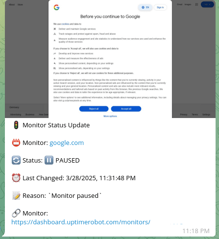

# UptimeRobot Alerts to Telegram with Visual Verification
**Automatically sends Telegram notifications with optional screenshots when monitors change status (✅ UP/🔴 DOWN/⏸️ PAUSED)**

Example Message in Telegram:



## Who Is This For?
Teams or individuals needing to:
- Get alerts when websites/services go down
- Verify outages with visual screenshots
- Monitor infrastructure from Telegram

## What Does This Workflow Solve?
🚨 **Missed Alerts**: Get immediate notifications in Telegram  
🖼️ **Visual Verification**: Optional screenshot confirmation of outages  
📊 **Status Tracking**: Clear records of when issues began/resolved  
🔗 **One-Click Access**: Direct links to affected monitors  
⏱️ **Time Savings**: No need to check dashboards manually

## Setup Guide

### 1. Pre-Requisites
- **UptimeRobot Account**: With at least one monitor configured
- **Gmail Account**: To receive alert notifications
- **Telegram Account**: To receive alerts (mobile/desktop app recommended)
- *(Optional)* **ScreenshotMachine** free/paid account

### 2. Credentials Setup
Make sure your n8n instance is connected with:
- **Gmail Account** (via OAuth2)
- **UptimeRobot API** (via API key)
- **Telegram Bot** (via bot token)
- *(Optional)* **ScreenshotMachine** (via customer key)

### 3. Configure Your n8n Workflow Nodes

#### 1. Alert Trigger
- **Gmail Trigger**: Configure to watch for emails from `alert@uptimerobot.com`
- Set appropriate polling interval (e.g., every 5 minutes)

#### 2. Monitor Configuration
- **Conf Node**: Set your preferences:
```json
{
  "take_screenshot": true,
  "screenshotmachine_secret": "your-secret-here",
  "screenshotmachine_device": "desktop",
  "screenshotmachine_dimension": "1366xfull", 
  "screenshotmachine_format": "png"
}
```
#### 3. Notification Settings
- **Telegram Nodes**:
  - Set your Chat ID (find with [@getidsbot](https://t.me/getidsbot))
  - Customize message formatting if needed

#### 4. Service-Specific Setup

##### UptimeRobot:
1. Go to [Dashboard → My Settings → API Settings](https://uptimerobot.com/dashboard#mySettings)
2. Create API key with "Monitor Read" permissions
3. Enable email alerts in monitor settings

##### Telegram Bot:
1. Message [@BotFather](https://t.me/BotFather) to create new bot
2. Get your Chat ID using [@getidsbot](https://t.me/getidsbot)
3. Add bot token to n8n credentials

##### ScreenshotMachine (Optional):
1. Sign up at [screenshotmachine.com](https://www.screenshotmachine.com/)
2. Get Customer Key from account dashboard
3. Set your secret phrase if using hash verification

### Final Steps
1. Test your workflow by manually triggering a monitor status change
2. Verify Telegram notifications arrive as expected
3. Check screenshot quality if enabled
4. Monitor for a few days to fine-tune alert preferences

**Happy Monitoring!**
